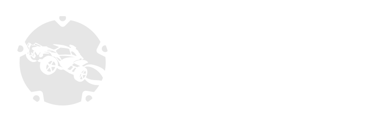

Blazingly fast rust interface for the RLBot v5 socket api. Examples are
available in the
[`rlbot/examples`](https://github.com/RLBot/rust-interface/tree/master/rlbot/examples)
folder, and documentation is available through the `cargo doc` command.
